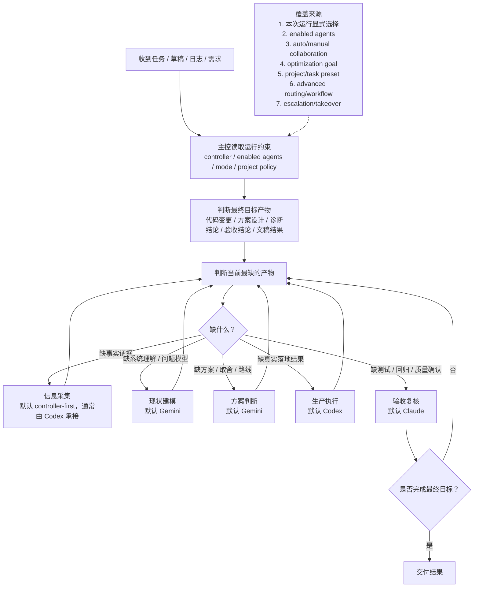
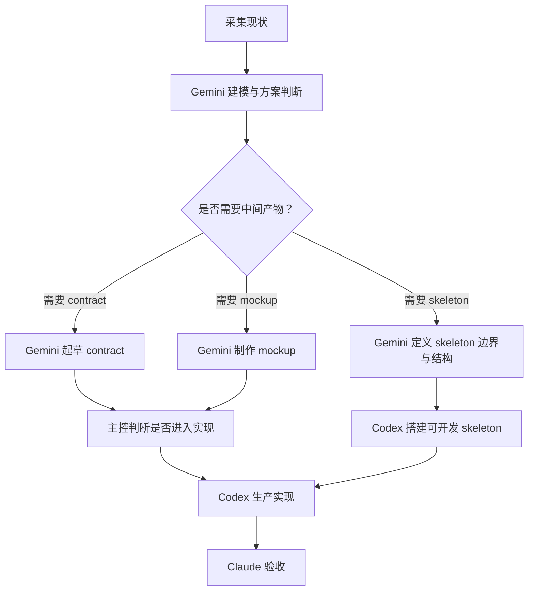
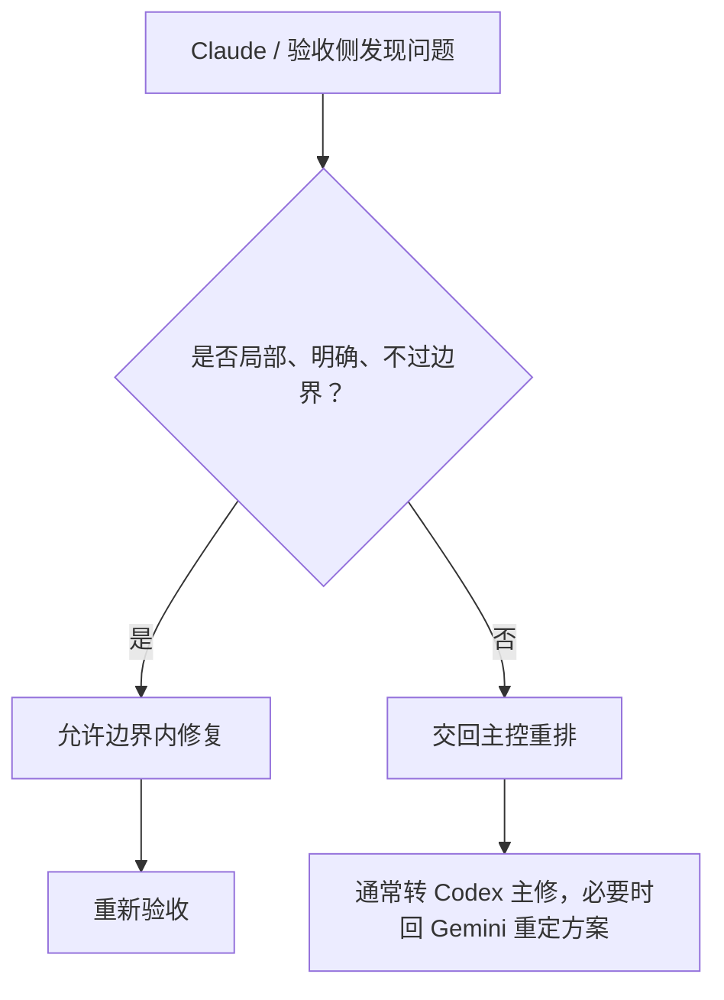
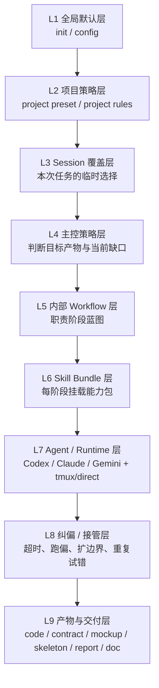
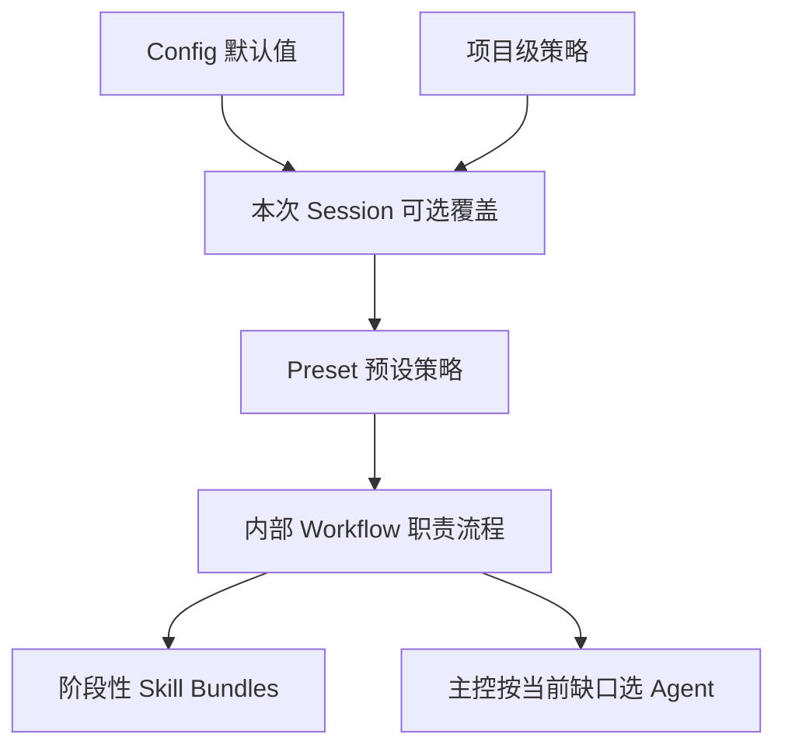

# ai-collab 默认编排与职责路由基准（中文）

> 本文是 `ai-collab` 后续优化设计的**基准概念文档**。未来的编排逻辑、主控 skill、角色 skill、工具权限与默认提示词，均应优先与本文保持一致。
>
> 如当前代码行为与本文不一致，应以：
>
> 1. 本文定义的目标基准
> 2. `docs/PRODUCT_DIRECTION_ZH.md`
> 3. `docs/AI_COLLAB_FULL_FLOW_REFERENCE_ZH.md` 中记录的“当前实现现状”
> 4. `docs/VNEXT_RUST_PLATFORM_ARCHITECTURE_ZH.md` 中定义的 vNext 平台边界
>
> 的顺序理解。

## 1. 文档定位

本文回答五个问题：

1. `ai-collab` 对各种任务的**默认编排逻辑**应该是什么
2. 默认逻辑应如何按**职责阶段**而不是按“固定 Agent 顺序”来理解
3. 哪些默认值应该对用户保持无感，哪些设置可以覆盖默认行为
4. `mockup / contract / skeleton / 文档 / 验收` 这类中间产物应如何路由
5. 后续主控 skills、角色 skills、工具边界应如何围绕统一概念设计

本文不是“当前代码逐字段说明”，而是：

- 面向未来优化的**产品基准**
- 能覆盖前端、后端、测试、游戏、调试、研究、文档等广义任务的**统一模型**

## 2. 讨论收敛摘要

本次讨论最终收敛出以下结论：

1. 不应把任务理解成固定的 `Gemini -> Codex -> Claude`
2. 稳定单元不是 Agent，而是**职责阶段**与**目标产物**
3. 主控的核心职责不是“按模板发人”，而是**判断当前最缺什么产物**
4. 默认三 Agent 全开时，系统应尽量自动完成职责分配，普通用户不需要理解细粒度路由
5. 用户表层应配置“风格与偏好”，而不是配置每个职责的底层路由
6. `信息采集` 不是单一动作，至少应拆成：
   - 抓事实
   - 建模型
   - 补证复核
7. `文档` 不是单一任务类型，而是一种交付形式；应按文档的实质内容来决定主笔者
8. `mockup / contract / skeleton` 不应混在一起看，它们分别代表不同层级的中间产物
9. 主控除了“派发”之外，还必须承担**纠偏与边界约束**职责：当某个 Agent 运行过久、任务扩张、偏离目标、重复试错或越过边界时，应主动收束、重排或中止

## 2.1 为什么会从原任务走到这份基准文档

本轮工作的实际演进路径是：

1. 最初问题不是抽象理论，而是 `ai-collab` 在真实使用中出现了：
   - 规划展示体验差
   - 主控 JSON 生成与解析异常
   - Agent 角色分工与用户预期不一致
   - `Codex / Claude / Gemini` 在不同流程里出现路由漂移
2. 为了修这些问题，我们先讨论了“系统默认到底应该怎么理解”
3. 讨论过程中发现，真正缺的不是局部 patch，而是一份可以指导后续设计的**统一基准**
4. 因此当前这份文档不是偏题，而是为了解决原问题的上游根因：如果没有统一基准，后续 planner、workflow、skills、提示词、配置都会持续漂移

换句话说：

- **原本在修流程与编排问题**
- **之所以做到现在这件事，是因为我们发现应该先补“编排定义层”**
- **这份文档本身就是后续修实现的前置依赖**

## 2.2 当前优先级判断

截至本轮讨论结束，优先级建议如下：

1. **最高优先级**：统一编排基准
   - 因为它会直接影响 planner、controller prompt、workflow、skills、配置语义
2. **第二优先级**：把现有实现对齐到基准
   - 尤其是 workflow 模板、routing、planner prompt、controller skill
3. **第三优先级**：继续打磨界面与交互
   - 包括滚动区、预览区、确认页、错误提示等

所以当前阶段，没有比“统一基准”更上游、更紧急的事情。

但从实现动作上看，**下一步最紧急**的不是继续扩写文档，而是：

- 开始把现有 planner / workflow / skills / config 逐项对齐本文

## 3. 核心概念

### 3.1 主控（Controller）

主控负责：

1. 读取当前 run 约束
2. 判断当前任务的最终目标产物
3. 判断当前最缺的产物
4. 选择默认承接职责的 Agent
5. 在失败、小修、升级、接管之间做决策
6. 监控任务是否超时、跑偏、扩边界、重复试错
7. 在必要时执行纠偏、收束、重排、降级或中止
8. 汇总最终交付

### 3.2 职责阶段（Responsibility Stage）

职责阶段是稳定编排单元。本文默认使用以下阶段：

1. 主控判断
2. 信息采集
3. 现状建模
4. 方案判断
5. 执行拆解
6. 生产执行
7. 验收复核
8. 边界内修复
9. 纠偏与约束
10. 升级与接管
11. 交付与记录

### 3.3 目标产物（Target Artifact）

主控首先应判断本次任务的最终目标是什么。常见目标产物包括：

- 代码 / 配置 / 功能改动
- 方案 / 架构 / mockup / contract
- 根因分析 / 调试结论
- 验收报告 / 风险结论
- 文稿 / 研究总结 / 对比报告

### 3.4 中间产物（Intermediate Artifact）

中间产物是为了降低返工和误判而引入的阶段性输出。本文重点定义三类：

- `contract`：规则、字段、状态、输入输出边界
- `mockup`：视觉与交互草稿
- `skeleton`：后续可继续开发的工程骨架

### 3.5 边界内修复（Small Bounded Fix）

边界内修复是指：

- 问题局部明确
- 影响范围小
- 不改变接口契约
- 不改变状态模型
- 不改变模块边界
- 不需要新的方案判断或重构

如果不满足上述条件，则不应视作边界内修复，而应交回主控重排。

### 3.6 纠偏（Correction / Boundary Enforcement）

纠偏是主控的一项基础职责，指主控在运行中持续判断：

- 当前任务是否仍然服务于原始目标产物
- 当前 Agent 是否在合理时间内取得阶段性进展
- 当前执行是否出现了任务扩张、重复试错、上下文漂移或过度优化
- 当前修改是否已经越过“边界内修复”或本次任务约束

主控一旦判定出现上述问题，应采取以下动作之一：

1. 收束任务范围
2. 回退到上一个清晰产物
3. 改派给更合适的职责承接者
4. 降级目标
5. 中止当前分支并向用户确认

## 4. 总原则

### 4.1 编排原则

`ai-collab` 的默认逻辑应是：

- **先判断目标产物**
- **再判断当前缺口**
- **再路由到默认最合适的职责承接者**

### 4.2 路由原则

默认路由必须满足：

1. 路由依据首先是**职责缺口**，不是“任务名看起来像什么”
2. 默认三 Agent 全开时，普通用户应尽量不需要手动干预
3. 只有在失败、歧义、高风险、项目规则要求时，才显式插入更多中间产物
4. 表层配置应控制“工作风格”，高级配置才控制“底层职责路由”
5. 主控必须具备纠偏权：任何子任务只要出现超时、跑偏、扩边界、重复试错，都允许主控主动修正

### 4.3 用户体验原则

产品必须允许灵活性，但灵活性不应直接暴露为负担：

- 默认：全自动、多 Agent、低学习成本
- 表层：少量偏好开关
- 高级：专家级职责路由覆盖

## 5. 默认值基准

在无特殊覆盖的基准场景下，默认值应为：

| 项目 | 基准默认值 |
| --- | --- |
| 默认主控 | `Codex` |
| 默认启用 Agent | `Codex + Claude + Gemini` |
| 默认协作模式 | 自动协作 |
| 默认规划策略 | 先规划后执行 |
| 默认优化目标 | `balanced` |
| 默认信息采集 | `controller-first`，通常落到 `Codex` |
| 默认现状建模 | `Gemini` |
| 默认方案判断 | `Gemini` |
| 默认生产执行 | `Codex` |
| 默认验收复核 | `Claude` |
| 默认边界内修复 | 验收侧可做小修，超边界回主控重排 |

## 6. 默认逻辑总流程图



## 7. 职责阶段总表

| 流程阶段 | 职责说明 | 典型动作 | 产物 / 完成标准 | 默认 Agent | 常见覆盖来源 |
| --- | --- | --- | --- | --- | --- |
| 主控判断 | 读取约束、判断目标产物与当前缺口 | 读 workspace、任务草稿、可用 Agent、项目规则 | 当前 run 决策框架 | 当前 `controller` | 本次运行显式选择 |
| 信息采集 | 收集事实证据 | 搜代码、抓日志、跑命令、看配置、必要时查资料 | 最小证据包 | `controller-first`，通常 `Codex` | `current_controller`、enabled agents、单 Agent 模式 |
| 现状建模 | 把事实组织成系统理解 | 梳理模块、状态、调用链、关系图、问题结构 | 问题模型 / 系统模型 | `Gemini` | 无 `Gemini`、速度优先、advanced routing |
| 方案判断 | 做取舍、给方向、决定是否需要中间产物 | 列选项、评估风险、定是否需要 mockup/contract/skeleton | 一份执行方向 | `Gemini` | 无 `Gemini`、任务极清楚、速度优先 |
| 执行拆解 | 把方向转成可执行任务单 | 拆步骤、定依赖、界定边界修复范围 | 执行清单 | 主控 | manual mode、特殊 workflow |
| 生产执行 | 产出真实落地结果 | 改代码、改配置、接接口、联调、搭骨架 | 可运行结果 / 真改动 | `Codex` | 无 `Codex`、单 Agent、旧 workflow |
| 验收复核 | 判断是否真的完成 | 测试、回归、边界检查、安全/风险复核 | 验收结论 | `Claude` | 无 `Claude`、速度优先、旧 workflow |
| 边界内修复 | 对小问题做局部补洞 | 补判空、修断言、修小样式、单点小逻辑 | 通过验收或明确升级 | 验收侧小修，执行侧主修 | `small-fix policy`、主控判断 |
| 纠偏与约束 | 监控超时、跑偏、扩边界、重复试错，并强制收束 | 缩范围、回退、降级目标、改派、要求先汇总 | 回到清晰边界内的任务状态 | 主控 | 超时阈值、项目规则、manual override |
| 升级与接管 | 问题超出边界、失败重试、重新派发 | 回主控、换承接者、决定接管 | 新一轮分派 | 主控 + takeover Agent | `escalation policy` |
| 交付与记录 | 输出最终结果并同步文档 | 汇总修改、说明验证、记录风险 | 最终可交付结果 | 主控 | 项目规则、文档策略 |

## 8. 中间产物规则

### 8.1 三类中间产物

| 中间产物 | 默认定位 | 默认决定者 | 默认制作者 | 说明 |
| --- | --- | --- | --- | --- |
| `contract` | 规则与边界定义产物 | `Gemini` | `Gemini` | 字段契约、状态矩阵、空态/错误态、输入输出约束 |
| `mockup` | 视觉与交互草稿产物 | `Gemini` | `Gemini` | 布局、信息架构、关键状态、低/中/高保真原型 |
| `skeleton` | 工程骨架产物 | `Gemini` 决定是否需要 | `Gemini` 定义结构，`Codex` 落地搭建 | 目录、占位组件、路由、stub、最小可开发骨架 |

### 8.2 中间产物流转图



### 8.3 产物等级建议

| 产物等级 | 适用情况 | 常见形式 |
| --- | --- | --- |
| `L1` 文本方案 | 低风险、任务较清楚 | 简短方案、任务说明、优先级 |
| `L2` 契约方案 | 涉及接口、状态、空态异常态 | contract、状态表、字段矩阵 |
| `L3` 可视初稿 | UI/交互/玩法风险高 | mockup html、页面草图、状态稿 |
| `L4` 非生产骨架 | 极复杂且返工成本高 | skeleton、伪结构、占位实现 |

## 9. 文档类任务的默认逻辑

### 9.1 核心判断

文档不是单一任务类型，而是一种交付形式。主控应先判断文档的本质是在做什么。

### 9.2 文档默认承接表

| 文档类型 | 默认主笔 | 默认复核 | 默认落盘者 | 说明 |
| --- | --- | --- | --- | --- |
| 基准规则 / 产品策略 / 编排逻辑文档 | `Gemini` | `Claude` | `Codex` | 需要全局抽象、统一结构与正式文件落地 |
| 实现方案 / 技术设计 / contract 说明 | `Gemini` | `Codex` / `Claude` | `Codex` | 前者定方案，后者检查可落地性与完整性 |
| README / 变更说明 / 实现文档 | `Codex` | `Claude` | `Codex` | 更贴近真实改动与项目结构 |
| 测试报告 / 验收记录 / 风险清单 | `Claude` | 主控 | `Codex` | 更偏边界覆盖、质量判断与记录 |
| 调研总结 / 对比报告 / 非开发分析文稿 | `Gemini` | `Claude` | `Codex` | 归纳、比较、表达清晰度更重要 |

### 9.3 当前这类“基准文档”任务的默认逻辑


## 10. 典型任务的默认流程

### 10.1 贪吃蛇小游戏

| 目标偏好 | 默认流程 |
| --- | --- |
| 速度优先 | 采集现状最小化 → `Codex` 直接做最小可玩版本 → `Claude` 验收 → 必要时小修 |
| 质量 / 美观优先 | 采集现状 → `Gemini` 做玩法/视觉方案与必要 mockup → `Codex` 实现 → `Claude` 验收 |

### 10.2 ProjectPrinting 的 Widget 设计与 Vue 落地 + 后端接口适配

默认流程：

1. `Codex / 主控` 采集现有组件、接口、权限、相邻模式
2. `Gemini` 输出 `contract` 与必要的 `mockup`
3. 如复杂度高，再由 `Gemini` 定义 `skeleton` 边界
4. `Codex` 实现 Vue、接后端、联调
5. `Claude` 做回归、权限、边界与质量验收
6. 小修可边界内完成；大改回主控重排

### 10.3 Moonlight 串流卡顿 / 日志诊断

默认流程：

1. 主控先按 `网络 / 编码 / 解码 / 显示 / 配置` 维度归类
2. `Codex / 主控` 采集日志、配置、复现条件
3. `Gemini` 归纳病结、假设树、试验顺序
4. `Codex` 执行配置修复、脚本验证、A/B 试验
5. `Claude` 或主控复测并确认是否稳定解决

## 11. 边界内修复规则

### 11.1 允许视作边界内修复的情况

- 文案、断言、判空
- 局部样式与小交互
- 单个测试修补
- 小范围逻辑补洞，且不改变接口契约、状态模型、模块边界

### 11.2 必须升级的情况

- 改接口字段或协议
- 改状态流或状态模型
- 改模块边界或目录结构
- 本质上是多处系统性问题
- 需要新方案、新抽象或重构

### 11.3 边界内修复流转图



## 12. 设置如何覆盖默认值

### 12.1 覆盖优先级

| 优先级 | 覆盖来源 | 会替换什么 |
| --- | --- | --- |
| 1 | 本次运行显式选择 | 当前 `controller`、是否多 Agent、是否只诊断不执行、是否先做 mockup |
| 2 | `enabled agents` | 某个默认承接者不可用时，职责必须退化 |
| 3 | 自动/手动协作模式 | 关闭自动协作后，多 Agent 自动拆分弱化 |
| 4 | 优化目标 | `speed-first` 减少 handoff；`quality-first` 强制分析/验收拆开 |
| 5 | 项目 / 任务级 preset | 如“前端先 mockup”“调试先取证”“实现优先” |
| 6 | 当前主控 | 影响主控吸收职责的范围，尤其是信息采集 |
| 7 | 高级 routing / workflow 覆盖 | 显式改变默认职责承接者 |
| 8 | escalation / takeover 策略 | 决定失败后谁接管、何时停止、何时询问用户 |

### 12.2 Agent 数量退化规则

| 可用 Agent 数 | 退化策略 |
| --- | --- |
| 3 个 | 使用完整默认职责路由 |
| 2 个 | 合并相邻职责：常见是采集+执行、分析+验收 |
| 1 个 | 同一 Agent 顺序完成全部职责阶段 |

### 12.3 纠偏触发条件建议

主控默认应在以下情况下考虑启动纠偏：

| 触发信号 | 主控默认动作 |
| --- | --- |
| 单个 Agent 长时间无阶段性产出 | 要求先汇总现状，再决定继续、换人或收束 |
| 任务描述被悄悄扩写 | 拉回原目标，必要时拆成“本次 / 后续” |
| 连续多次试错但没有新证据 | 中止盲试，要求先补证据或重建模型 |
| 小修逐渐变成重构 | 终止边界内修复，回主控重排 |
| 过度优化、脱离用户当前目标 | 降级为最小可交付版本或回到确认节点 |
| 新中间产物越长越多却不落地 | 要求停止扩写，转入执行或确认 |

## 13. 表层配置与高级配置边界

### 13.1 设计原则

自由度必须存在，但不应把复杂性全部暴露给用户。应坚持：

- **表层配置控制“风格与偏好”**
- **高级配置控制“路由与细节”**

### 13.2 配置层级建议

| 层级 | 面向对象 | 应包含内容 | 不应包含内容 |
| --- | --- | --- | --- |
| 零配置默认 | 新用户 | 三 Agent 全开、自动协作、平衡模式 | 任意职责细路由 |
| 表层配置 | 大多数用户 | 默认主控、启用哪些 Agent、自动/手动协作、速度/平衡/质量偏好、项目预设 | `responsibility_routing`、`intent_preferences` 细节 |
| 项目级策略 | 某个仓库 / 某类任务 | 前端先 mockup、调试先取证、实现优先、项目专属规范 | 全局底层路由结构 |
| 高级配置 | 专家用户 | routing、workflow 覆盖、接管策略、职责 fallback | 默认暴露在主 UI |

### 13.3 推荐暴露给普通用户的配置

| 配置项 | 推荐默认 |
| --- | --- |
| 默认主控 | `Codex` |
| 启用哪些 Agent | 三个全开 |
| 协作模式 | 自动 |
| 优化目标 | `balanced` |
| 项目策略预设 | 自动路由 |

### 13.4 当前产品分层模型

`ai-collab` 应按以下层级理解：



#### 13.4.1 各层说明

| 层级 | 当前实际是什么 | 怎么使用 | 是否应暴露给普通用户 | 可配置还是自动 |
| --- | --- | --- | --- | --- |
| `L1 全局默认层` | `init` / `config` / setup，设置 controller、providers、runtime、入口方式 | 首次初始化、长期默认 | 是 | 可配置 |
| `L2 项目策略层` | project profile、项目 preset、项目规范与本地规则 | 按仓库长期生效 | 只需少量感知 | 项目级可配置，部分自动识别 |
| `L3 Session 覆盖层` | workspace、task、controller、planner mode、本次临时偏好 | 每次新任务可覆盖默认值 | 是 | 可配置 |
| `L4 主控策略层` | controller prompt + routing + orchestrator 的综合决策 | 用户不直接操作，只看结果 | 否 | 默认自动，高级可影响 |
| `L5 Workflow 层` | 职责阶段蓝图 | 系统内部决定阶段顺序与门禁 | 否 | 默认自动，维护者可改 |
| `L6 Skill Bundle 层` | workflow skills、persona skills、项目 skills | 给阶段挂载能力包 | 否 | 默认自动，维护者可扩展 |
| `L7 Agent / Runtime 层` | `Codex / Claude / Gemini` + `tmux/direct` | 决定谁来做、在哪跑 | 部分可见 | 部分可配置，部分自动 |
| `L8 纠偏 / 接管层` | escalation / takeover / correction | 失败或跑偏时收束与接管 | 默认否 | 默认自动，高级可调阈值 |
| `L9 产物与交付层` | code、plan、report、doc、mockup、contract、skeleton | 用户最终消费的结果 | 是 | 自动生成，受前面各层影响 |

#### 13.4.2 各层回答的问题

| 层级 | 它回答什么问题 |
| --- | --- |
| `L1` | 默认怎么开机 |
| `L2` | 这个项目一般该怎么做 |
| `L3` | 这次任务想怎么做 |
| `L4` | 当前最缺什么 |
| `L5` | 系统按哪些职责阶段跑 |
| `L6` | 这一阶段需要哪些能力 |
| `L7` | 谁来做、用什么 runtime 做 |
| `L8` | 跑偏了怎么办 |
| `L9` | 最后交付什么 |

### 13.5 Preset / Workflow / Skills / Agent 的正式区分

#### 13.5.1 核心定义

| 名称 | 面向谁 | 本质 | 典型例子 | 默认是否暴露给普通用户 |
| --- | --- | --- | --- | --- |
| `Preset / 预设策略` | 用户 | 这次任务想采用什么工作风格 | `快速实现`、`精致设计`、`调试优先`、`PP 核心模块` | 是 |
| `Workflow / 职责流程` | 系统 | 内部按哪些职责阶段运行 | `采集 -> 建模 -> 方案 -> 执行 -> 验收 -> 纠偏` | 否 |
| `Skill Bundle / 技能包` | 系统 / 维护者 | 每个阶段自动挂载哪些能力 | `mockup + contract + review + diagnostics` | 否 |
| `Agent Routing / Agent 承接` | 系统 | 当前阶段默认由谁承接 | `Gemini` 方案、`Codex` 实现、`Claude` 验收 | 否 |

#### 13.5.2 三者关系



#### 13.5.3 预设策略的来源与覆盖顺序

预设策略应允许每次不同，但不应强迫用户每次都重新选择。推荐三层来源：

| 来源层 | 作用 | 例子 |
| --- | --- | --- |
| 全局默认 | 长期习惯 | 默认 `balanced`、自动协作 |
| 项目默认 | 某仓库长期偏好 | `PP` 项目默认先 `mockup + contract` |
| Session 覆盖 | 单次任务临时变化 | “这次贪吃蛇要快速版” |

推荐顺序：

1. `config` 放长期默认
2. 项目级规则放仓库长期策略
3. Session 启动时允许用户临时覆盖

#### 13.5.4 谁来询问预设策略

推荐机制：

- `ai-collab` 的 Session 启动层负责询问这次任务的工作风格
- 主控只在运行中出现重大歧义、边界冲突或风险确认时再追问用户

即：

- 入口层问“这次想怎么做”
- 主控运行中只问“是否确认风险性变更 / 越界调整”

#### 13.5.5 Workflow 是否应暴露给用户

默认不应直接暴露。

普通用户应看到的是：

- 这次的预设策略
- 一句可理解的流程摘要

例如：

- “本次使用调试优先策略：系统会先采集证据，再做根因分析，再决定是否修改”

而不是要求用户直接编辑内部 workflow 图。

#### 13.5.6 Skills 的来源策略

Skills 应分三层来源：

| 来源层 | 定义 | 建议策略 |
| --- | --- | --- |
| 内置核心 skills | 产品自带、长期维护的核心能力 | 应预置，不依赖现场获取 |
| 项目级推荐 skills | 某类项目常用的扩展能力 | 可按项目自动推荐或启用 |
| 外部扩展 skills | 临时缺失时从外部补充 | 仅建议，不应默认自动永久安装 |

推荐原则：

1. 核心职责必须有内置 skill 支撑
2. 项目特化需求可由项目级 skill 补齐
3. 主控可以建议新增 skill，但不应默认自动永久写入全局配置

### 13.6 当前实现与目标模型的对比

#### 13.6.1 当前实现概括

当前 `ai-collab` 实际上是“多层结构已经存在，但边界尚未完全收敛”的状态：

- `config / init` 已经承担了较多默认值管理职责
- planner / routing / orchestrator 已部分转向新逻辑
- 但 workflow 模板仍大量保留旧式 `primary / reviewer` 顺序
- `mockup / contract / skeleton` 尚未形成统一的中间产物协议
- 纠偏更多还是“失败后 takeover”，还不够像运行中的主动约束

#### 13.6.2 对比表

| 维度 | 之前 / 当前实际 | 讨论后目标 |
| --- | --- | --- |
| 用户看到什么 | `controller + planner + 一些 routing/config` | 用户主要看到 **Preset + 少量偏好** |
| 主控角色 | 偏“规划器 / 派发器” | **规划 + 路由 + 纠偏 + 边界约束** |
| Workflow 定义 | 偏固定 `primary/reviewer` 顺序 | **职责阶段蓝图**，按缺口补产物 |
| Agent 分工 | 仍带明显固定角色残留 | **先按职责，再选 Agent** |
| 文档任务 | 常被当成单一 workflow | **按文档实质内容路由** |
| `mockup / contract / skeleton` | 没统一建模 | 成为显式中间产物 |
| config 表层 | 暴露了不少 routing 概念 | 表层只保留“风格与默认值” |
| skills | 分散在 workflow / persona / 项目里 | 变成 **阶段性 skill bundles** |
| 纠偏机制 | 主要是失败后的 takeover | **运行中就能纠偏** |
| 用户认知成本 | 偏高，概念容易混 | 更清楚：`Preset -> Workflow -> Skills -> Agent` |

#### 13.6.3 当前 workflow 与目标 workflow 的区别

当前 workflow 更接近：

- 一组内置任务模板
- 大多按固定顺序串接角色
- 典型形态是 `design -> implement -> review` 或 `implement -> review -> refine`

讨论后的目标 workflow 应定义为：

- 不是任务模板，也不是 Agent 顺序表
- 而是按目标产物与当前缺口驱动的职责阶段蓝图

即从：

```text
Gemini -> Codex -> Claude
```

转向：

```text
主控判断
-> 信息采集
-> 现状建模
-> 方案判断
-> 中间产物
-> 生产执行
-> 验收复核
-> 纠偏 / 接管
-> 交付
```

## 14. 角色与 skills 设计基准

本文的角色设计应优先以“职责角色”来建模，而不是直接把 Agent 名称写死在 skill 上。

### 14.1 角色总表

| 角色 | 核心职责 | 默认 Agent | 必备技能方向 | 必备工具方向 | 何时交接 |
| --- | --- | --- | --- | --- | --- |
| Controller / Router | 判断目标产物、当前缺口、决定是否 handoff / 接管，并负责纠偏与边界约束 | 当前 `controller` | 任务归类、缺口判断、优先级、升级策略、纠偏、汇总 | 运行上下文、计划编辑、结果汇总 | 需要具体职责产出时 |
| Investigator | 抓事实、找证据、取上下文 | `controller-first`，通常 `Codex` | 代码搜索、日志诊断、配置核对、复现步骤 | 终端、搜索、日志读取、项目扫描 | 证据采集完毕后 |
| Modeler / Analyst | 建模、归纳问题结构、解释现状 | `Gemini` | 架构理解、问题树、上下文整合、风险建模 | 文本分析、结构化输出、对比总结 | 模型建立后 |
| Specifier / Designer | 给出方案、决定并产出 contract/mockup/skeleton 边界 | `Gemini` | 方案比较、交互设计、契约设计、结构草拟 | 文档、原型、结构图、HTML mockup | 需要真实落地时 |
| Implementer | 落地真实改动 | `Codex` | 编码、重构、联调、集成、脚本化 | 编辑、构建、测试、终端 | 实现完成后 |
| Validator / Reviewer | 验收、回归、边界与风险判断 | `Claude` | 测试设计、回归、风险审查、质量门 | 测试、检查、复核、报告 | 发现大问题时回主控 |
| Recorder / Documentarian | 形成正式记录与 repo 文档 | 按文档类型决定；通常 `Codex` 落盘 | 结构化记录、规范化表达、差异说明 | 文档编辑、摘要汇总 | 文档定稿后 |

### 14.2 Controller Skill 基准要求

主控 skill 应至少具备：

1. 读取 run 约束并识别优先级覆盖
2. 判断目标产物与当前缺口
3. 决定是否需要中间产物
4. 决定是否 handoff、是否回收职责、是否升级
5. 能识别超时、跑偏、扩边界、重复试错、过度优化
6. 在必要时执行纠偏、收束、降级目标或中止当前分支
7. 在失败重试与 takeover 之间做稳定判断
8. 汇总阶段性结果并形成用户可理解的进度说明

### 14.3 Investigator Skill 基准要求

调查 / 采集 skill 应至少具备：

1. 本地项目快速搜索
2. 日志与报错提取
3. 配置差异核对
4. 复现步骤整理
5. 外部资料的最小必要检索

### 14.4 Analyst / Specifier Skill 基准要求

分析 / 方案 skill 应至少具备：

1. 代码库与模块结构理解
2. 问题树与假设树构建
3. 方案比较与 trade-off 说明
4. `contract` 起草
5. `mockup` 策略与产出
6. `skeleton` 是否需要及边界定义

### 14.5 Implementer Skill 基准要求

实现 skill 应至少具备：

1. 真实工程改动能力
2. 跨文件联动能力
3. 接口适配与集成能力
4. 在不改变既有边界时完成快速主修
5. 能把分析产物转化为 repo 中真实文件

### 14.6 Validator Skill 基准要求

验收 / 复核 skill 应至少具备：

1. 手动 / 自动验收项设计
2. 回归测试与边界检查
3. 风险与安全复核
4. 是否属于边界内修复的判断
5. 验收结论、缺陷分级与升级建议

## 15. 面向实现的产品落地要求

后续如果要让 `ai-collab` 真正按照本文演化，应优先完成以下对齐：

1. 把 planner prompt、controller prompt、orchestrator 路由统一到“职责阶段模型”
2. 把 workflow 模板中与本文冲突的旧角色分配逐步收敛
3. 保持表层 `init/config` 简洁，只暴露风格型设置
4. 把细粒度职责覆盖与 fallback 留给 advanced config
5. 为 Controller、Investigator、Analyst、Specifier、Implementer、Validator 建立对应 skill 规范
6. 为 `mockup / contract / skeleton / doc / acceptance report` 定义统一产物协议

### 15.1 建议实施路线

#### P0：建立 V2 基础骨架

目标：

- 不再继续扩展旧 workflow 语义
- 在不破坏现有运行的前提下，建立一套新的 `Preset + Workflow V2` 基础结构
- 让后续 planner、router、skills、config 都有明确的 V2 落点

范围：

1. 定义 `Preset` 的正式 schema
2. 定义 `Workflow V2` 的正式 schema
3. 定义少量通用蓝图，例如：
   - `delivery-loop`
   - `design-led-loop`
   - `diagnose-loop`
   - `research-loop`
   - `validation-loop`
   - `document-loop`
4. 把旧 workflow 明确视为 `legacy`
5. 在代码层建立最小解析与测试能力

本阶段不要求：

- 完成 UI 接入
- 完成全量 router 替换
- 删除旧 workflow

当前进度（2026-03-17）：

- 已完成 `Workflow V2` 基础注册表与内建蓝图 / preset 骨架
- 已在配置层加入 `default_session_preset` 与 `workflow_engine`，且默认值已切换为 `v2`
- 已在 orchestrator 输出中补充 `workflow_engine / session_preset / workflow_blueprint`
- 已将 planner / controller prompt 与 controller plan schema 升级为 **V2 兼容语义**：
  - 顶层可表达 `workflow_engine / session_preset / workflow_blueprint`
  - step 层可表达 `responsibility_stage / artifact_type / boundary / timebox_minutes`
  - execution prompt 已要求主控按阶段边界执行，而不是只按 Agent 名称理解步骤
- 运行时已改为 **V2 默认，legacy 兼容回退**：
  - 旧内建 workflow 名称会优先映射到 V2 蓝图执行
  - 用户自定义 legacy workflow 仍可作为兼容层继续运行
  - `legacy` 不再是主设计目标，只保留兼容职责
- detector / router 已开始直接输出 V2 路由元信息：
  - `workflow_engine / session_preset / workflow_blueprint`
  - `responsibility_stages`
  - CLI 在进入 runtime 执行前会把这些字段继续透传给 workflow runtime
- trigger 配置现在只保留 V2 语义：
  - 默认模板 trigger 使用 `session_preset` 表达主路由
  - 旧字段 `workflow` / `legacy_workflow` 只会在 merge / migrate 时被清理，不再反向映射出新的 `workflow_blueprint`
- 显式 `workflow_blueprint` 的路径已补齐一致性：
  - detector 会为蓝图自动回填匹配的 `session_preset`
  - workflow runtime 在只拿到蓝图时，也会按蓝图对齐摘要元信息
  - 这样 V2 可以真正以 blueprint 为主，而不是依赖 legacy workflow 名称
- legacy 已从主链路彻底移除：
  - CLI → runtime 主执行入口已改为优先传递 `workflow_blueprint`
  - CLI 不再透传 `legacy_workflow`
  - detector / runtime / list 命令都只暴露 `session_preset + workflow_blueprint`
  - trigger migrate 现会补齐 `workflow_blueprint`，让默认配置从源头偏向 V2
  - `legacy_workflows.json` / `workflows.json` / `config/workflows.template.json` 不再属于当前架构
  - CLI `list` 只展示 `Session Presets`

#### P1：把运行时切到 V2 语义

目标：

- 让 planner、controller、orchestrator 真正按 `Preset -> Workflow V2 -> Skill Bundles -> Agent Routing` 运作

范围：

1. planner JSON 升级到职责阶段与产物语义
2. router / orchestrator 升级为“按缺口路由”
3. correction / takeover 升级为“运行中纠偏 + 失败后接管”
4. 中间产物协议接入 planner 与执行链
5. 让新 session 默认优先走 V2

#### P2：收口用户层与移除 legacy

目标：

- 把复杂度收回系统内部
- 让普通用户主要感知 `Preset`
- 在新链路稳定后逐步移除旧 workflow

范围：

1. 把表层 `config` 收敛为偏好与 preset
2. 完成项目级 preset 接入
3. 完成角色 skill / bundle 体系
4. 把旧 workflow 降为兼容层，最终移除
5. 收尾 UI 与恢复链路

## 16. 最终定义（一句话版本）

`ai-collab` 的默认逻辑应定义为：

**主控持续判断当前最缺的产物，并把该职责默认路由给最合适的 Agent；稳定的是职责阶段与产物，不是固定的 Agent 顺序。**

进一步压缩为：

- 先判断目标产物
- 再判断当前缺口
- 再决定谁来承接该职责
- 小修不过界，大改回主控
- 用户表层配置风格，高级层配置路由
