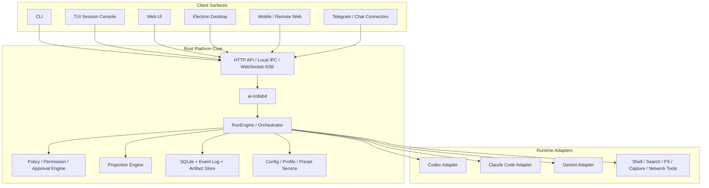
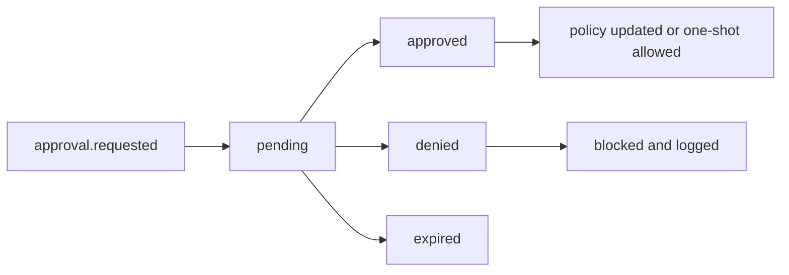

# ai-collab vNext Rust 平台架构基准（中文）

> 本文是 `ai-collab` 下一阶段的**平台级权威文档**。它回答的不再是“当前 Python CLI 怎么继续修”，而是：
>
> 1. `ai-collab` 在彻底脱离 Python 核心后，应该变成什么
> 2. 如何借鉴 `Claude Code` 的先进经验，但不照抄它的产品边界
> 3. 如何同时支撑 `TUI / WebUI / Electron / 手机远程端 / 多设备会话`
> 4. 如何保留 `PyPI` 安装方式，同时建立新的跨平台分发体系
>
> 与其他文档的关系如下：
>
> - `docs/PRODUCT_DIRECTION_ZH.md`：定义产品方向与 surface 分层
> - `docs/AI_COLLAB_ORCHESTRATION_BASELINE_ZH.md`：定义职责阶段、默认编排与角色基准
> - `docs/CONFIG_HIERARCHY_ZH.md`：定义当前配置层级与影响面
>
> 如果未来的技术实现与旧版 Python 代码行为冲突，**vNext 的平台设计应优先以本文为准**。

---

## 1. 为什么需要这份文档

这次已经不是“继续把 Python 版 `ai-collab` 打磨漂亮一点”的问题了。

真正的问题是：

1. 当前项目的核心实现仍然是 Python CLI
2. 但产品目标已经演进为：
   - 多 Agent 编排台
   - 多端共享同一运行状态
   - 支持远程观察、审批、接管
   - 未来存在 `WebUI / Electron / 手机端 / 多设备会话`
3. 这意味着产品本体已经从“命令行工具”转向“平台 + 协议 + 客户端体系”

如果继续以 Python CLI 为根，再往上挂 Web、桌面端、远程桥接、移动观察面板，后续只会越来越难拆。

所以本文明确给出结论：

- `Python` 不再承担产品核心
- `Rust` 成为唯一平台核心
- `PyPI` 仅保留为分发入口之一，不再代表技术栈
- 所有前端都基于同一套后端协议和运行模型

---

## 2. 我们现在到底在做什么

`ai-collab vNext` 不应被定义为：

- 又一个 Coding CLI
- 一个 TUI 项目
- 一个 Web 仪表盘
- 一个 tmux 管理器

它应被定义为：

**面向多个 Coding Agent 的跨平台编排平台。**

这句话有四层含义：

1. `ai-collab` 自己不是某一个 Agent
2. `ai-collab` 的核心价值是编排、观察、纠偏、恢复、交付
3. `TUI / WebUI / Electron / Mobile` 都只是这个平台的不同入口
4. `Codex / Claude Code / Gemini CLI` 是被接入的 runtime，不是产品骨架本身

---

## 3. 对未来 TUI / GUI 效果的统一理解

### 3.1 已经可以明确的部分

从目前的讨论里，未来体验目标已经非常清楚：

1. 默认入口不应再是 setup / config
2. 用户进入 `ai-collab` 后，看到的应该是**运行中的协作指挥台**
3. 用户应该能同时看到：
   - 主控在做什么
   - 当前计划走到哪一步
   - 哪些 Agent 在运行、等待、失败、需要确认
   - 日志、diff、artifact、总结、审批请求
4. 用户应该能直接在界面里：
   - 回复主控提问
   - 审批/拒绝高风险动作
   - 中断、重派、接管、重试
   - 切换观察视角
   - 查看历史 run 并恢复

换句话说，未来的主界面不是聊天框，也不是 pane 拼贴，而是：

**实时、多 Agent、事件驱动的协作控制台。**

### 3.2 TUI 应该是什么感觉

未来 TUI 应该具备这些感受：

1. 打开后就是 `Session Console`
2. 主界面围绕 `run / event / step / agent / artifact / approval`
3. 可以像操作台一样快速输入命令、切换视角、干预运行
4. 不是 tmux pane 的壳
5. 不是“配置器”
6. 在能力上尽量接近 Web，而不是被当成降级版

### 3.3 GUI 应该是什么感觉

未来 GUI 应该具备这些感受：

1. 可以生动看到多个模型协作过程
2. 可以清晰区分：
   - 主控决策
   - Worker 执行
   - 系统事件
   - 审批与阻断
3. 支持更强的可视化：
   - 时间线
   - 步骤卡片
   - Agent 轨道
   - artifact 面板
   - diff / log / report inspector
4. 既能看，也能操作
5. 适合作为桌面端和远程浏览器的共享界面

### 3.4 还没有完全定死的部分

真正尚未完全定死的不是交互模型，而是**视觉语言与客户端实现语言**。

当前可以明确：

1. 交互模型已经很清楚
2. 后端协议模型必须先稳定
3. 视觉风格、动效细节、TUI 客户端具体技术栈可以在协议稳定后继续迭代

也就是说：

- **未来交互模型已经足够清晰**
- **最终视觉皮肤和动效语言仍然应该晚于平台协议定稿**

---

## 4. 为什么 `Claude Code` 会显得特别好用

`Claude Code` 的优秀之处，不在于它“是 TypeScript 写的”，而在于它把几个关键东西做成了一体化产品。

### 4.1 最值得学习的 7 个设计原则

| 原则 | `Claude Code` 的体现 | `ai-collab` 应怎么借 |
| --- | --- | --- |
| 单一引擎拥有会话生命周期 | `QueryEngine` 统一拥有对话、工具、上下文、权限、恢复 | 建立 `RunEngine`，统一拥有 run 生命周期 |
| 工具是产品原语 | 工具集中注册、显式启用、统一暴露 | 建立 `ActionRegistry + ToolRegistry + AdapterRegistry` |
| 权限系统是一等公民 | 明确 allow/ask/deny、来源、原因、模式 | 把审批/权限做成正式协议，而不是 UI 特判 |
| 状态管理非常严格 | AppState、slice 订阅、状态来源清晰 | 用 `event log + projection` 做统一状态源 |
| 命令面很强 | `/resume`、`/doctor`、`/permissions`、`/mobile` 等命令体系丰富 | TUI/CLI/Web 都共用同一组正式 action |
| 支持远程与桥接 | remote session、WebSocket、remote approval | 从一开始就设计 `local + remote + multi-device` |
| 上下文是被策展的 | system prompt parts、memory、tool gating | 把“事实/模型/方案/执行/验收”做成阶段化上下文 |

### 4.2 最不该误学的部分

有些地方值得借鉴理念，但不适合直接照抄：

1. `Claude Code` 以单 Agent 会话为主
2. 它的 UX 重心仍然偏“一个 agent 的强力工作台”
3. 它的 provider/product coupling 很深
4. 它的代码结构不是为多 Agent 编排而生

所以 `ai-collab` 应借的不是它的“产品边界”，而是它的：

- 系统感
- 一致性
- 状态纪律
- 权限设计
- 远程桥接意识

---

## 5. vNext 的正式结论

`ai-collab vNext` 的技术和产品结论应明确为：

### 5.1 已定结论

1. `Rust` 是唯一平台核心
2. `Python` 不再承担运行时核心职责
3. `PyPI` 只保留为安装入口之一
4. `TUI / WebUI / Electron` 都是一等公民
5. 所有客户端共享同一个后端协议
6. 所有 Agent 都通过 runtime adapter 接入
7. 所有 run 状态都由统一 daemon 管理

### 5.2 仍可保留弹性的部分

1. TUI 客户端最终用 Rust 还是 TS 实现，可在协议稳定后再定
2. WebUI 的具体框架选型可以后定
3. Electron 是否与 Web 共享全部 UI 层，可在应用层再评估

但这些都是**客户端实现问题**，不应影响平台核心。

---

## 6. 平台总体架构



---

## 7. 分层设计

### 7.1 L0：Distribution Layer

负责：

1. 安装
2. 更新
3. 平台识别
4. 二进制分发
5. 桌面应用打包

输出给用户的是：

- `ai-collab`
- `ai-collabd`
- `desktop app`

### 7.2 L1：Platform Core

这是产品核心，只允许 `Rust`。

负责：

1. run / session 生命周期
2. orchestrator
3. plan / step / artifact / recovery
4. 审批与权限
5. 事件流和投影
6. 状态持久化

### 7.3 L2：Runtime Adapter Layer

负责把外部 agent 或本地工具统一接入平台。

包括：

1. `Codex`
2. `Claude Code`
3. `Gemini CLI`
4. shell / search / fs / browser 等系统能力

### 7.4 L3：Protocol Layer

负责定义：

1. 统一 domain object
2. 统一 action
3. 统一 event
4. 统一 approval 请求格式
5. 统一多客户端通信协议

### 7.5 L4：Client Layer

负责：

1. TUI
2. CLI
3. WebUI
4. Electron
5. Mobile / Remote Web
6. 聊天连接器

客户端只负责：

- 呈现
- 交互
- 调用 action
- 订阅 event

客户端不负责业务真逻辑。

---

## 8. 核心进程模型

### 8.1 `ai-collabd`

平台的唯一真核心进程。

职责：

1. 持有本机或远程节点的 run 状态
2. 负责 orchestrator 与 runtime adapter 调度
3. 管理事件流、审批、artifact、恢复
4. 为所有客户端暴露 API 与订阅通道

建议模式：

1. `local daemon`
2. `remote daemon`
3. `embedded daemon`（桌面端内置启动）

### 8.2 `ai-collab`

这是用户面对的统一入口命令。

职责：

1. 连接或拉起本地 daemon
2. 进入 CLI / TUI 行为
3. 发送 action
4. 订阅运行状态

### 8.3 Electron / Web / Mobile

这些都是 daemon 的客户端。

它们不应该各自再实现：

- 编排逻辑
- 运行状态管理
- Agent 调度
- 权限判断

---

## 9. 领域模型

未来协议里的核心对象应至少包括：

### 9.1 核心对象

| 对象 | 作用 |
| --- | --- |
| `Run` | 一次完整协作运行 |
| `Session` | 某个客户端或控制连接 |
| `Plan` | 当前运行的计划 |
| `Step` | 计划中的可执行步骤 |
| `AgentBinding` | 某个 agent 与步骤或角色的绑定 |
| `Artifact` | 代码、文档、mockup、report、bundle 等产物 |
| `ApprovalRequest` | 高风险动作、外部访问、越界操作等审批请求 |
| `RecoverySnapshot` | 可恢复状态快照 |
| `Projection` | 面向 UI 的投影视图 |
| `RunEvent` | 所有状态变更的统一事实流 |

### 9.2 重要原则

1. `RunEvent` 是事实源
2. `Projection` 是 UI 可读状态
3. `Snapshot` 是恢复优化，不是事实源
4. `Plan` 可以被改写，但要留下事件历史
5. `ApprovalRequest` 必须有显式生命周期

---

## 10. 事件与动作模型

### 10.1 事件模型

建议至少包含以下事件类别：

| 事件类别 | 典型例子 |
| --- | --- |
| run 生命周期 | `run.created`、`run.started`、`run.completed` |
| planning | `plan.generated`、`plan.revised`、`step.inserted` |
| step 生命周期 | `step.started`、`step.blocked`、`step.completed` |
| agent 生命周期 | `agent.bound`、`agent.running`、`agent.waiting`、`agent.failed` |
| approval | `approval.requested`、`approval.granted`、`approval.denied` |
| artifact | `artifact.created`、`artifact.updated` |
| runtime | `adapter.connected`、`adapter.timeout`、`adapter.interrupted` |
| correction | `correction.triggered`、`scope.constrained`、`step.reassigned` |
| recovery | `snapshot.created`、`run.resumed` |

### 10.2 动作模型

所有客户端都应通过统一 action 对平台施加影响。

建议动作包括：

| 动作 | 说明 |
| --- | --- |
| `run.create` | 新建 run |
| `run.resume` | 恢复 run |
| `run.abort` | 终止 run |
| `plan.generate` | 生成计划 |
| `plan.edit` | 修改计划 |
| `step.assign` | 指派步骤 |
| `step.reassign` | 重派步骤 |
| `step.retry` | 重试步骤 |
| `step.skip` | 跳过步骤 |
| `approval.respond` | 响应审批 |
| `agent.interrupt` | 中断 agent |
| `agent.takeover` | 主控接管 |
| `artifact.export` | 导出 bundle / report |
| `session.attach` | 客户端附着到某个 run |

### 10.3 为什么要动作化

因为未来：

1. TUI 要调它
2. Web 要调它
3. Electron 要调它
4. 手机端要调它
5. TG 等连接器也要调它

只有动作化，才能避免每个客户端自己偷偷长业务逻辑。

---

## 11. 状态存储与恢复

### 11.1 建议的持久化策略

建议采用：

1. `SQLite`：结构化状态与索引
2. `Event Log`：事实流
3. `Artifact Directory`：文件产物
4. `Snapshot`：恢复优化

建议目录概念保留当前 `.ai-collab` 的心智，但实现改为 daemon 管理：

```text
.ai-collab/
  runs/
  artifacts/
  exports/
  cache/
  config/
```

### 11.2 恢复原则

恢复应基于：

1. `Run` 当前 phase
2. 最后事件位置
3. 待处理 approval
4. 当前已绑定 agent
5. 当前 artifacts
6. 可恢复的 projection

恢复绝不能依赖某个 UI 还保留着临时状态。

---

## 12. Runtime Adapter 设计

### 12.1 Adapter 的职责

每个 adapter 负责：

1. 启动目标 agent/runtime
2. 发送任务
3. 拉取输出
4. 识别状态
5. 提交 artifact / logs / diagnostics
6. 响应中断、超时、失败

### 12.2 Adapter 不应负责的事情

以下内容不应写进 adapter：

1. 产品编排逻辑
2. plan 编辑逻辑
3. 权限策略总控
4. UI 交互
5. 项目配置解释

### 12.3 三类 adapter

| 类型 | 例子 | 说明 |
| --- | --- | --- |
| Agent Adapter | `codex`、`claude-code`、`gemini-cli` | 负责连接外部 coding agent |
| System Tool Adapter | shell、search、capture、web fetch | 负责事实采集和本地能力 |
| Channel Adapter | TG、消息推送、邮件、Web 通知 | 负责远程审批与提醒 |

---

## 13. 权限、审批与安全

这是 `Claude Code` 最值得借的地方之一。

### 13.1 权限设计目标

系统必须让用户明确知道：

1. 现在是谁要做事
2. 要做什么
3. 为什么会触发审批
4. 这条审批来自什么规则或策略
5. 批准后会影响什么范围

### 13.2 审批对象

建议至少覆盖：

1. 高风险 shell 命令
2. 越目录操作
3. 网络访问
4. 写敏感文件
5. 长时间后台任务
6. 扩边界重构
7. 方案升级 / 目标降级
8. 远程设备控制权限

### 13.3 审批来源

建议支持：

1. 本地 TUI
2. WebUI
3. Electron
4. 手机远程端
5. TG 等消息通道

### 13.4 审批生命周期



### 13.5 权限策略模型

建议保留三层：

1. 全局默认策略
2. 项目策略
3. 单次 run 覆盖策略

并保留：

- `allow`
- `ask`
- `deny`

三态模型。

---

## 14. 多设备、远程与移动端

### 14.1 目标不是“手机上完整跑编排”

手机端更合理的定位是：

**远程观察与干预面板。**

它应该支持：

1. 看当前 run
2. 看主控与 worker 状态
3. 看审批请求
4. 回复主控问题
5. 查看日志、报告、总结
6. 进行中断、继续、批准、拒绝等有限操作

### 14.2 设备角色

建议定义：

| 角色 | 能力 |
| --- | --- |
| `viewer` | 只读观察 |
| `operator` | 可操作 run |
| `approver` | 可处理审批 |
| `owner` | 可接管、终止、改配置 |

### 14.3 远程连接模式

建议支持：

1. 本地 daemon + 本机客户端
2. 本地 daemon + 远程浏览器/手机
3. 远程 daemon + 本地桌面/Web 客户端
4. 多客户端同时附着一个 run

### 14.4 协议建议

建议：

1. 控制平面：HTTP JSON
2. 实时订阅：WebSocket
3. 简易只读订阅：SSE
4. 本地高性能连接：Unix socket / named pipe

---

## 15. 客户端体系

### 15.1 CLI

定位：

1. 脚本化入口
2. 非交互调用
3. 调试与管理
4. 快速命令面

### 15.2 TUI

定位：

1. 默认主入口
2. 专业操作者的高频主界面
3. 与 Web 同等重要

应具备：

1. timeline
2. multi-agent status
3. inspector
4. approval center
5. slash commands
6. history / resume

### 15.3 WebUI

定位：

1. 更强可视化
2. 跨设备接入
3. 审批和观察更方便
4. 更适合展示多 Agent 协作过程

### 15.4 Electron

定位：

1. 本地桌面主应用
2. 可内置本地 daemon 管理
3. 打通系统通知、深链接、文件拖放、桌面集成

### 15.5 Mobile / Remote Web

定位：

1. 轻量远程观察
2. 审批与回复
3. 紧急接管

### 15.6 TG / 消息连接器

定位：

1. 异步提醒
2. 审批
3. 简短交互

不应承担复杂 run 编辑。

---

## 16. TUI 的技术路线建议

### 16.1 已定前提

1. TUI 与 Web 都是一等公民
2. TUI 不能只是过渡工具
3. TUI 不能绑定 Python

### 16.2 当前推荐方案

当前推荐：

1. 平台核心：`Rust`
2. TUI 一期：优先 `Rust`
3. Web / Electron：`TypeScript`

原因：

1. Rust TUI 便于与 daemon 共用 domain model
2. 原生二进制分发更干净
3. 跨平台安装更稳
4. 不会把 Node/Bun runtime 再带入 CLI/TUI 分发主链路

### 16.3 保留的弹性

如果未来确认 TS TUI 在开发效率、交互体验上显著更优，也可以追加一个 `TS TUI client`。

但前提必须是：

1. 后端协议已经稳定
2. TUI 只是协议客户端之一
3. 不允许再反向侵蚀平台核心边界

---

## 17. 安装、分发与升级体系

### 17.1 必须保留的入口

用户当前已经在用：

```bash
pip install ai-collab
```

这条路径必须保留。

但保留的是：

- **安装入口**

不是：

- Python 业务运行时

### 17.2 新的分发体系

建议建立以下官方安装方式：

| 平台 | 安装方式 |
| --- | --- |
| Python 生态 | `pip install ai-collab` |
| macOS | `brew install ai-collab` |
| Windows | `winget install ai-collab` |
| Linux | 官方安装脚本 + 二进制包 |
| GUI | Electron 安装包 |

### 17.3 PyPI 的正式定位

PyPI 应改成：

1. 发布平台 wheel
2. wheel 内封装预编译 Rust 二进制
3. 安装后暴露 `ai-collab` 命令
4. Python 仅作为 PyPI 兼容壳，不承担产品核心逻辑

### 17.4 二进制组成

建议至少有：

| 二进制 | 作用 |
| --- | --- |
| `ai-collab` | 用户主入口 |
| `ai-collabd` | 后台服务进程 |
| `desktop app` | Electron 应用，内置或管理 daemon |

### 17.5 更新策略

建议支持：

1. CLI 检查更新
2. 桌面端自动更新
3. daemon 版本兼容检查
4. 客户端和 daemon 的协议版本协商

---

## 18. 仓库重构建议

建议把仓库正式转成 monorepo：

```text
/crates
  /ac_protocol
  /ac_core
  /ac_engine
  /ac_storage
  /ac_policy
  /ac_config
  /ac_artifacts
  /ac_runtime
  /ac_runtime_codex
  /ac_runtime_claude
  /ac_runtime_gemini
  /ac_daemon
  /ac_cli
  /ac_tui
  /ac_bridge

/apps
  /web
  /desktop

/packaging
  /pypi-launcher
  /homebrew
  /winget
  /installers

/docs
```

### 18.1 各 crate 建议

| crate | 作用 |
| --- | --- |
| `ac_protocol` | 统一 schema、actions、events、DTO |
| `ac_core` | 领域对象与基础规则 |
| `ac_engine` | orchestrator、planning、routing、correction |
| `ac_storage` | SQLite、event log、snapshot、artifact 索引 |
| `ac_policy` | permission、approval、scope、safety |
| `ac_runtime` | adapter trait 与 runtime 协议 |
| `ac_daemon` | 服务进程与 API 暴露 |
| `ac_cli` | 非交互命令入口 |
| `ac_tui` | Session Console |
| `ac_bridge` | 远程连接、通知、设备接入 |

---

## 19. 与现有文档和现有代码的关系

### 19.1 可以继承的东西

以下内容应保留并迁移：

1. 产品定位
2. 职责阶段模型
3. `Preset + Workflow V2` 语义
4. 配置层级心智
5. artifact 类型与边界修复概念
6. 纠偏与接管职责

### 19.2 不应继续继承的东西

以下内容不应再作为主线继续扩展：

1. Python CLI 作为产品核心
2. 以 tmux 控制逻辑作为主领域模型
3. setup/config 作为产品主界面
4. UI 层直接驱动编排逻辑
5. Python runtime 再继续承接 Web / 桌面 / 远程 的核心职责

### 19.3 对旧版的正式建议

建议把当前 Python 版定义为：

- `legacy-v1`

它的定位是：

1. 历史可运行版本
2. 概念参考
3. 兼容安装过渡期

而不是：

4. vNext 主干继续演化的基础

---

## 20. 实施路线图

### 20.0 总原则：验证优先，不允许“只完成代码，不完成验证”

从本阶段开始，`ai-collab vNext` 的 Rust 重构必须遵守一条硬规则：

**每完成一轮可声明的重构，都必须有真实可执行验证，验证通过后才允许进入下一轮。**

这里的“真实可执行验证”包括但不限于：

1. 领域层测试
   - 状态机推进
   - 事件写入
   - projection 生成
   - 恢复逻辑
2. 接口层测试
   - action 调用
   - API 响应
   - WebSocket / SSE 事件推送
   - 多客户端附着一致性
3. adapter 测试
   - mock adapter
   - 真实 CLI / agent 对接 smoke test
   - 中断、超时、失败、重试
4. 安装与运行测试
   - 本地无 Python 运行
   - 二进制启动
   - daemon 拉起
   - CLI / TUI 连接

这条规则有三层含义：

1. 不允许只写 schema，不验证状态流是否真能跑
2. 不允许只写 daemon，不验证 action / event / resume 是否真可用
3. 不允许只接入真实 AI，不验证失败、超时、审批、恢复这些最容易出问题的边界

因此，后续每个阶段都必须同时定义：

1. 交付物
2. 测试清单
3. 退出条件

如果测试没通过，该阶段就不算完成。

### 20.1 双轨推进原则：后端主线先行，前端并行但不反向绑死后端

你后面会和另一位前端协作者一起推进 WebUI，这完全可以并行进行，但必须遵守下面这条边界：

**前端可以与后端重构并行推进，但前端只能依赖稳定协议、稳定 projection 和 mock server，不能反过来要求后端为某个页面的临时长相去改核心模型。**

这意味着前后端应拆成两条并行工作轨：

#### A. 平台主线

负责：

1. domain model
2. event model
3. action model
4. storage / recovery
5. daemon
6. adapter
7. integration test

#### B. 前端协作线

负责：

1. WebUI 信息架构
2. 页面流与交互流
3. 事件流的可视化映射
4. approval center / timeline / inspector 原型
5. 基于 mock 数据和 mock server 的页面联调

前端协作线的最佳启动时机不是“后端全部做完之后”，而是：

1. `Run / Step / Agent / Artifact / Approval / Projection` 基本字段稳定之后
2. 第一版 mock payload 稳定之后
3. 第一版 `HTTP + WebSocket` 协议确定之后

也就是说：

- **前端不需要等真实 adapter 全部接好才开始**
- **但前端应建立在协议 contract 上，而不是建立在 Python 旧实现或某个临时 UI 输出上**

### 20.2 第一个真正的阶段目标

在进入“正常开发”前，必须先拿到一个明确的里程碑：

**你可以在本机安装并运行一个完全不依赖 Python 核心的 `ai-collab vNext` 最小版。**

这个里程碑至少应满足：

1. 不需要 Python 运行时来承载主产品逻辑
2. 可以启动 `ai-collabd`
3. 可以通过 `ai-collab` CLI 创建 run
4. 可以生成最小 plan
5. 可以推进最小 step 生命周期
6. 可以看到事件流和 projection
7. daemon 重启后可以恢复

在达到这个里程碑之前，所有工作都应视为**平台迁移期**，而不是“功能扩展期”。

### P0：冻结旧核心，确定新主线

目标：

1. 冻结 Python 运行时主线
2. 建立 Rust workspace
3. 明确 `legacy-v1` 与 `vNext` 边界

交付：

1. 本文落地
2. monorepo 目录骨架
3. 新版 crate 边界说明
4. 迁移阶段的验证规则写入文档与实施清单

退出条件：

1. 新开发不再继续往 Python 核心加大功能
2. 团队明确：后续每阶段必须有真实可执行测试

### P1：先做协议和核心，不做炫 UI

目标：

1. 定义 `Run / Event / Action / Projection / Approval`
2. 实现最小 `ac_protocol + ac_core + ac_engine + ac_storage`

交付：

1. 协议 schema
2. 事件日志
3. 最小 orchestrator
4. 最小恢复能力
5. mock payload / mock projection 样例

必须验证：

1. `Run / Event / Action / Projection / Approval` 类型能被序列化 / 反序列化
2. 状态机从 `run.create -> plan.generate -> step.start -> step.complete` 可推进
3. projection 可稳定重建
4. snapshot / replay 至少有一条 golden test
5. 前端协作可直接拿 mock payload 开始建页面，不需要依赖 Python 旧输出

退出条件：

1. 本地可以创建、保存、恢复 run
2. 协议已有足够稳定的第一版 contract，可供前端并行使用

### P2：做 daemon 和 adapter

目标：

1. 实现 `ai-collabd`
2. 先接入 `mock adapter`
3. 接入最小 shell/search/fs tool adapter
4. 建立真实 agent adapter 接口骨架

交付：

1. 本地 daemon
2. 可观察 agent 生命周期
3. 最小 approval 请求
4. `HTTP + WebSocket` 最小控制面

必须验证：

1. daemon 可独立启动、停止、重启
2. `run.create`、`plan.generate`、`approval.respond` 至少能走通一条黑盒链路
3. 第二个客户端附着后能看到一致 projection
4. daemon 崩溃 / 重启后可恢复未完成 run
5. mock adapter 能稳定复现 `running / waiting / failed / completed`

退出条件：

1. 能从 daemon 驱动一次稳定的 mock run
2. 前端可开始对接真实后端事件流，而不是只吃静态 JSON

### P3：接入真实 AI adapter，并完成无 Python 最小闭环

目标：

1. 接入 `Codex` adapter
2. 接入 `Claude Code` adapter
3. 接入 `Gemini` adapter
4. 跑通至少一条真实 AI 协作链路

交付：

1. 三个真实 agent adapter 的最小可用实现
2. 真实 adapter 的状态映射
3. timeout / interrupt / retry / failure 分类

必须验证：

1. 每个 adapter 至少有一条真实 smoke test
2. 至少一条两 Agent 或三 Agent run 能真实执行
3. 真实 run 中的 approval、interrupt、timeout、resume 至少各验证一类
4. 旧 Python 核心不参与主执行闭环

退出条件：

1. 你可以在本机测试一个**完全无需 Python 核心**的新版最小运行闭环
2. 到这里为止，才算真正进入“可以开始正常开发”的状态

### P4：做 CLI 与 TUI 主入口

目标：

1. `ai-collab` 连接/拉起 daemon
2. TUI 成为真正 Session Console
3. CLI 支持脚本化 action

交付：

1. 新 CLI
2. 新 TUI
3. slash command / action 面

必须验证：

1. `ai-collab` 可自动发现或拉起 daemon
2. CLI 可调用最小 action 集
3. TUI 可以附着到真实 run，看到 steps / agents / approvals / artifacts
4. 不借助 Python 主命令也能独立运行

退出条件：

1. 用户可以不用 Python 主流程也完成一次 run

### P5：建立正式分发体系

目标：

1. 保留 PyPI
2. 新增 brew / winget / installer
3. 建立版本检查与升级路径

交付：

1. 预编译二进制
2. PyPI binary wheels
3. 原生安装器

必须验证：

1. 在干净环境中安装后不需要 Python 参与主运行
2. `pip install ai-collab` 可得到可执行新版
3. `brew` / `winget` / 安装脚本至少验证其中两条
4. 安装后可直接创建 run 并连接 daemon

退出条件：

1. 普通用户不需要 Python 环境也能安装

### P6：做 WebUI / Electron

目标：

1. 把 WebUI 变成正式客户端
2. Electron 成为桌面应用

交付：

1. run dashboard
2. multi-agent timeline
3. approval center
4. artifact inspector
5. 前后端联调基线

前端并行协作建议：

1. 前端从 P1 开始基于 mock payload 并行推进
2. 前端从 P2 开始接 mock server / dev server
3. 前端从 P3/P4 开始接真实 daemon
4. 前端页面设计和组件体系可以持续演进，但必须基于稳定 contract

必须验证：

1. WebUI 可连接真实 daemon
2. WebUI 与 TUI 同时附着一个 run 时状态一致
3. approval 在 WebUI 中可正常往返
4. Electron 至少能跑通本地 daemon 附着

退出条件：

1. Web 与 TUI 能观察同一 run
2. 前端协作者可以在不依赖 Python 旧版的情况下正常开发

### P7：做多设备与移动远程

目标：

1. 手机远程观察与审批
2. 多客户端附着
3. TG 等异步连接器

交付：

1. pairing / auth
2. remote approval
3. viewer/operator role model

必须验证：

1. 手机浏览器或远程页面至少能完成查看 + 审批
2. 多设备同时连接不会破坏 run 一致性
3. 至少一条异步提醒链路可用

退出条件：

1. 用户可在不在电脑前的情况下处理审批与查看运行

### P8：移除旧主链路

目标：

1. 把旧 Python 主运行路径完全退出主产品线
2. 保留最小兼容层或安装壳

交付：

1. legacy 独立归档
2. 主产品只走 Rust 平台

必须验证：

1. 从安装到运行的主路径都不再依赖 Python 核心
2. 当前主要文档、README、发布流程都已切到新版主线
3. 旧链路移除后不影响基本安装与运行

退出条件：

1. 发布版默认不再依赖 Python 核心运行

---

## 21. 当前阶段的禁忌

为了避免再次走偏，当前阶段应明确禁止以下事情：

1. 在 Python 主干上继续加大体量的新运行时功能
2. 先做重 UI，再补协议
3. 让 Web/Electron 各自长自己的业务逻辑
4. 继续以 tmux pane 作为未来 UI 心智骨架
5. 把手机端误做成“迷你完整客户端”
6. 过早把客户端实现语言争论成最关键问题

真正的优先级应该是：

1. 协议
2. 核心
3. daemon
4. adapter
5. TUI/CLI
6. Web/Electron
7. Mobile/remote

---

## 22. 最终总结

一句话总结这份文档：

**`ai-collab vNext` 不是 Python CLI 的继续扩建，而是一个以 Rust 为核心、以 daemon 为中枢、以统一协议连接 TUI / WebUI / Electron / Mobile 的多 Agent 编排平台。**

而从 `Claude Code` 身上最该学的，不是 UI 长相，也不是语言本身，而是：

1. 强核心引擎
2. 工具作为产品原语
3. 权限作为正式 UX
4. 状态与恢复纪律
5. 远程与桥接意识
6. 一致的命令与交互面

对 `ai-collab` 来说，这些原则一旦和：

- 多 Agent 编排
- 职责阶段模型
- 纠偏与接管
- run/event 协议
- 多端共享观察面

结合起来，才会真正形成属于自己的平台形态。
